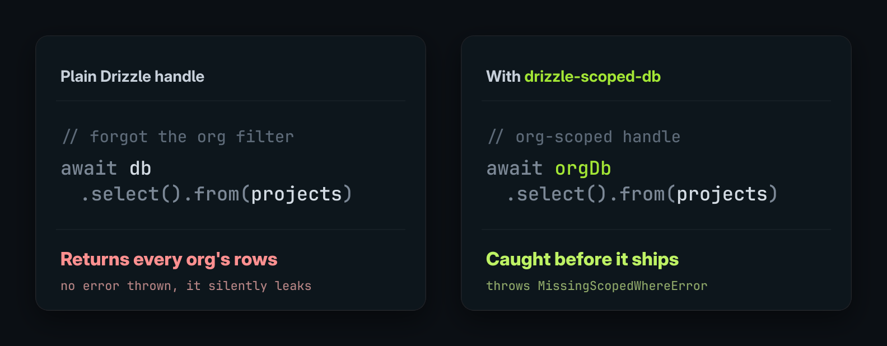

# drizzle-scoped-db

[](https://www.npmjs.com/package/@modemdev/drizzle-scoped-db)
[](https://www.npmjs.com/package/@modemdev/drizzle-scoped-db)
[](#development)
[](./LICENSE)

**One forgotten `WHERE` clause and a query returns rows it should never see. `drizzle-scoped-db` guards against that.**

<p align="center">
  
</p>

It wraps a Drizzle ORM handle in a typed, scoped one (`orgDb`, `tenantDb`, `workspaceDb`). The guardrail fits any predicate a query must never forget: tenant, org, user, region, soft-delete. Scope predicates are injected into your queries automatically, and in strict mode a scoped query that forgets to include scope context throws at the call site, before it reaches the database.

```ts
// Throws MissingScopedWhereError instead of returning every workspace's projects
await workspaceDb.select().from(projects);

// Allowed: scoped predicate is present (and re-injected as defense in depth)
await workspaceDb.select().from(projects).where(eq(projects.workspaceId, workspaceId));
```

### TL;DR

- 🛡️ **Strict by default.** A missing `where` or missing scope context throws instead of leaking rows.
- 🤖 **Catches the mistakes humans, codegen, and AI agents make.** The forgotten scope filter surfaces in review and at runtime, not in an incident.
- 🧩 **Dialect-generic.** Built on Drizzle core types (Postgres, SQLite, MySQL, SingleStore), no DB lock-in. Layers with RLS rather than replacing it.

## Where this fits

drizzle-scoped-db is an application-layer guardrail in the query builder. It isn't database-enforced isolation, and it's built to sit alongside RLS, not compete with it.

|                       | Enforcement layer   | Isolation model                    | DB lock-in             | Catches app-code mistakes |
| --------------------- | ------------------- | ---------------------------------- | ---------------------- | ------------------------- |
| **drizzle-scoped-db** | App (query builder) | Shared tables + injected predicate | None (dialect-generic) | ✅ typed + loud failures  |
| Drizzle native RLS    | Database            | Shared tables + row policies       | Postgres-only          | ❌ enforced below the app |
| drizzle-multitenant   | App (middleware)    | Schema-per-tenant                  | Postgres-only          | n/a (different model)     |
| pgvpd                 | Proxy / wire        | RLS via protocol proxy             | Postgres-only          | ❌                        |
| Nile                  | DB vendor           | Virtual tenant DBs                 | Nile-specific          | ❌                        |

RLS gives you a boundary the application can't bypass, but it lives in the database: per-row policy evaluation, connection-pooling friction, silent failures that are hard to debug, and Postgres only. PlanetScale [covers the tradeoffs](https://planetscale.com/blog/rls-sounds-great-until-it-isnt) in detail. drizzle-scoped-db keeps the scope boundary in application code instead, where it's visible in TypeScript, type-checked, and loud: a forgotten predicate throws instead of returning the wrong rows. If you want a database-level backstop too, layer RLS underneath. See [How this relates to RLS](#how-this-relates-to-rls).

## Why use it

- Pass typed scoped DB handles instead of the raw DB.
- Declare scoping rules once per table.
- Strict mode by default: missing `where` or missing scope context throws.
- Inject scope predicates into supported selects, joins, mutations, and relational root queries.
- Validate scoped inserts before they reach the database.
- Catch missing predicates in human-written, generated, or agent-authored code.

## Use cases

`drizzle-scoped-db` is a guardrail for any predicate a query must never forget. The scope is whatever you express as a Drizzle `where`:

- **Tenant or org isolation.** Keep `tenant_id = currentTenant` on every query so one customer never sees another's rows.
- **Per-user data.** Force `user_id = currentUser` on private rows.
- **Region or data residency.** Keep `region = 'eu'` on every query.
- **Soft deletes.** Always exclude deleted rows with `isNull(table.deletedAt)` via [`scopeByPredicate`](#custom-scope-rules).
- **Visibility.** A read handle that injects `published = true`, so public endpoints never surface drafts.
- **Row-level ACLs.** A composite predicate such as `owner_id = me OR shared_with @> me`.

These share the same boundaries: the guardrail covers tables with rules, on the wrapped handle, in application code, not as a database-enforced boundary. See [Security model](#security-model).

## How this relates to RLS

RLS is enforced by the database. `drizzle-scoped-db` is enforced by the application path: scoped code receives a scoped Drizzle handle instead of the raw DB. It focuses on typed query builders, explicit scoped capabilities, and loud failures when predicates are missing.

```ts
const workspaceDb = createScopedDb(db, {
  scopeName: "workspace",
  scopeValue: workspaceId,
  rules,
});

const project = await workspaceDb
  .select({
    id: projects.id,
    name: projects.name,
  })
  .from(projects)
  .where(and(eq(projects.id, projectId), eq(projects.workspaceId, workspaceId)));

// Also injected automatically: eq(projects.workspaceId, workspaceId)
```

Conceptually, strict mode makes scoped reads look like this:

```sql
WHERE projects.id = projectId
  AND projects.workspace_id = workspaceId -- caller wrote this; strict mode checks the scope column is mentioned
  AND projects.workspace_id = workspaceId -- wrapper injects this authoritative guard
```

The predicate appears twice on purpose. You write it so the boundary is visible in code review and type-checked by TypeScript. Strict mode verifies you didn't forget to mention the scope context, then the wrapper injects its own authoritative copy as a backstop. The duplicate is redundant SQL that costs basically nothing in practice; what it buys is a thrown error instead of a silent cross-scope read when someone forgets the predicate.

Application code that should be scoped should receive the scoped DB handle, not the raw Drizzle instance.

The two approaches are not mutually exclusive, and neither is strictly "above" the other:

- **App-layer scoping (this package)** keeps isolation where your code lives: typed, reviewable, dialect-generic, and loud on mistakes. It can't constrain code that deliberately bypasses the scoped handle (see [Security model](#security-model)).
- **Database RLS** is a boundary the app can't bypass, but it's Postgres-only and carries the operational costs PlanetScale documents in [_RLS sounds great until it isn't_](https://planetscale.com/blog/rls-sounds-great-until-it-isnt): per-row policy evaluation, pooling friction, and silent failures.

Use app-layer scoping as your primary, visible guardrail; add RLS underneath when you also want a database-level boundary that holds even if app code goes around the wrapper. On MySQL, SingleStore, or other engines without RLS, app-layer scoping is the practical path.

## Install

```bash
npm install @modemdev/drizzle-scoped-db drizzle-orm
```

```bash
pnpm add @modemdev/drizzle-scoped-db drizzle-orm
```

Drizzle is a peer dependency.

## Quick start

```ts
import { createScopedDb, scopeByColumn } from "@modemdev/drizzle-scoped-db";
import { and, eq } from "drizzle-orm";
import { projects, tasks } from "./schema";

const workspaceDb = createScopedDb(db, {
  scopeName: "workspace",
  scopeValue: workspaceId,
  rules: [scopeByColumn(projects, projects.workspaceId), scopeByColumn(tasks, tasks.workspaceId)],
});

const project = await workspaceDb
  .select()
  .from(projects)
  .where(and(eq(projects.id, projectId), eq(projects.workspaceId, workspaceId)));
```

The wrapper still injects the workspace predicate again as defense in depth.

Joined tables with declared rules receive their own scope predicates too. For joins, the joined table predicate is added to the join condition so `leftJoin` keeps its outer-join behavior:

```ts
const rows = await workspaceDb
  .select()
  .from(projects)
  .leftJoin(tasks, eq(tasks.projectId, projects.id))
  .where(and(eq(projects.id, projectId), eq(projects.workspaceId, workspaceId)));

// Also injected automatically:
// - eq(projects.workspaceId, workspaceId) in the WHERE clause
// - eq(tasks.workspaceId, workspaceId) in the JOIN condition
```

## Insert validation

For `scopeByColumn(table, table.scopeColumn)`, inserted rows are validated against the current scope value by default. The rule infers the insert payload key from the table property that owns the column.

```ts
await workspaceDb.insert(projects).values({
  id: projectId,
  workspaceId,
  name: "Roadmap",
});

// Throws InvalidScopedInsertError
await workspaceDb.insert(projects).values({
  id: projectId,
  workspaceId: "another-workspace",
  name: "Wrong workspace",
});
```

Batch inserts are validated row by row.

You usually do not need `insertKey`: Drizzle insert payloads use the table property key (`workspaceId`) even when the SQL column is named `workspace_id`. Keep `insertKey` for advanced wrappers or unusual column objects where the payload key cannot be inferred, or pass `insertKey: false` to disable insert payload validation explicitly.

## Update and delete

Scoped predicates are injected into mutations too. `scopeByColumn` validates update payloads by default using the same inferred table property key. Pass `updateKey: false` only for deliberate scope-moving flows, such as an admin transfer that reassigns a row to another workspace.

```ts
await workspaceDb
  .update(tasks)
  .set({ status: "done" })
  .where(and(eq(tasks.id, taskId), eq(tasks.workspaceId, workspaceId)));

await workspaceDb
  .delete(tasks)
  .where(and(eq(tasks.id, taskId), eq(tasks.workspaceId, workspaceId)));

// Throws InvalidScopedUpdateError: scoped rows cannot be moved across scopes.
await workspaceDb
  .update(tasks)
  .set({ workspaceId: "another-workspace" })
  .where(and(eq(tasks.id, taskId), eq(tasks.workspaceId, workspaceId)));
```

## Relational query API

Declare `queryName` to scope `db.query.<name>.findFirst` and `findMany`.

Older Drizzle relational queries use callback-style `where` clauses:

```ts
const workspaceDb = createScopedDb(db, {
  scopeName: "workspace",
  scopeValue: workspaceId,
  rules: [scopeByColumn(projects, projects.workspaceId, { queryName: "projects" })],
});

const project = await workspaceDb.query.projects.findFirst({
  where: (project, { and, eq }) =>
    and(eq(project.id, projectId), eq(project.workspaceId, workspaceId)),
});
```

Drizzle 1.0's RQBv2 API uses object filters instead. `scopeByColumn` configures the object-filter guard automatically when it can resolve the column's TypeScript property key:

```ts
const project = await workspaceDb.query.projects.findFirst({
  where: { AND: [{ id: projectId }, { workspaceId }] },
});
```

On RQBv2 scoped roots, callback or SQL `where` shapes are rejected so Drizzle cannot ignore them. Tables without a matching rule pass through for plain root `findFirst` / `findMany` calls.

### Nested `with` includes

On the callback/SQL relational API (Drizzle 0.45), nested `with` includes are scoped automatically: each included relation whose target table has a rule gets that rule's scope predicate injected into its own `where`, recursively, so eager-loading cannot surface another scope's rows. Included tables without a rule (e.g. a global lookup table) load normally. An include fails closed if the wrapper cannot resolve a relation to a table or a rule cannot produce its predicate.

```ts
// tasks whose target table is scoped are filtered to the current scope; unscoped `notes` load in full
const project = await workspaceDb.query.projects.findFirst({
  where: { AND: [{ id: projectId }, { workspaceId }] },
  with: { tasks: { with: { notes: true } } },
});
```

Nested `with` scoping is not yet available on the RQBv2 object-filter API (Drizzle 1.0); there, `with` includes still fail closed when relational scoped rules are configured. Use explicit scoped joins or separate scoped queries for related rows.

## Data model shape

This package works best when scope ownership is represented in your schema:

- scope columns on scoped tables
- scoped rules for protected tables
- indexes for scoped access paths, e.g. `(scope_id, id)` and `(scope_id, foreign_id)`
- globally unique IDs or constraints that reject invalid cross-scope references

Write rules explicitly for small schemas, or generate them once from schema metadata in an app-specific facade.

Explicit rules:

```ts
const rules = [
  scopeByColumn(projects, projects.workspaceId),
  scopeByColumn(tasks, tasks.workspaceId),
  scopeByColumn(comments, comments.workspaceId),
];
```

Generated rules:

```ts
const tenantScopedRules = Object.values(schema)
  .filter((table) => isDrizzleTable(table) && "tenantId" in table)
  .map((table) => scopeByColumn(table, table.tenantId, { columnName: "tenant_id" }));
```

With either shape, the wrapper can scope root tables and joined tables with rules. Your schema still owns data consistency, such as preventing a task in one scope from referencing another scope's project.

## Strict mode

Strict mode is enabled by default and intended for most app code. Scoped selects, updates, deletes, and relational queries must include a `where` clause with the declared scope context.

For `scopeByColumn(...)`, strict validation is intentionally syntactic: it checks that the scoped table's column appears in the caller predicate (or that the RQBv2 object filter contains the scoped property, including under `AND` / `OR` / `NOT`). It does not prove the operator is equality or that the compared value is the active scope value. The wrapper's injected predicate is the authoritative runtime guard.

Callers write the scope predicate, the wrapper verifies scope context is present, then injects its own predicate. If generated code, agent-authored code, or a rushed refactor omits scope context entirely, the query throws.

```ts
const workspaceDb = createScopedDb(db, {
  scopeName: "workspace",
  scopeValue: workspaceId,
  rules: [scopeByColumn(projects, projects.workspaceId)],
});

// Throws MissingScopedWhereError
await workspaceDb.select().from(projects);

// Throws MissingScopedPredicateError
await workspaceDb.select().from(projects).where(eq(projects.id, projectId));

// Allowed; the wrapper still injects its own scope predicate as defense in depth.
await workspaceDb
  .select()
  .from(projects)
  .where(and(eq(projects.id, projectId), eq(projects.workspaceId, workspaceId)));

// Also passes strict validation because the scope column is mentioned, but the
// injected `eq(projects.workspaceId, workspaceId)` guard is what enforces scope.
// (`ne` is imported from drizzle-orm.)
await workspaceDb.select().from(projects).where(ne(projects.workspaceId, workspaceId));
```

The predicate must sit on the scoped table itself: filtering a joined table's same-named column (e.g. `eq(tasks.workspaceId, workspaceId)` while selecting `projects`) does not satisfy the check. Aliases of scoped tables are rejected unless the alias has its own explicit scoped rule, so an alias cannot silently bypass rule lookup.

Opt out with `strict: false` if you want pure predicate injection:

```ts
const workspaceDb = createScopedDb(db, {
  scopeName: "workspace",
  scopeValue: workspaceId,
  strict: false,
  rules: [scopeByColumn(projects, projects.workspaceId)],
});

await workspaceDb.select().from(projects).where(eq(projects.id, projectId));
// Executes with: and(eq(projects.id, projectId), eq(projects.workspaceId, workspaceId))
```

## Custom scope rules

Use `scopeByColumn` with an object map for composite column scopes. It derives the injected predicate, insert/update validation, strict SQL validation, and RQBv2 object-filter support from one declaration.

```ts
import { createScopedDb, scopeByColumn } from "@modemdev/drizzle-scoped-db";

const scopedDb = createScopedDb(db, {
  scopeName: "workspace-region",
  scopeValue: { workspaceId, regionId },
  rules: [
    scopeByColumn(records, {
      workspaceId: records.workspaceId,
      regionId: records.regionId,
    }),
  ],
});
```

Use `scopeByPredicate` for predicates that cannot be represented as column equality, such as soft deletes or visibility flags:

```ts
import { createScopedDb, scopeByPredicate } from "@modemdev/drizzle-scoped-db";
import { isNull } from "drizzle-orm";

const visibleDb = createScopedDb(db, {
  scopeName: "not-deleted",
  scopeValue: true,
  rules: [
    scopeByPredicate(posts, {
      where: () => isNull(posts.deletedAt),
      strictColumns: [posts.deletedAt],
    }),
  ],
});
```

Pass an array to `scopeByPredicate(...)` when multiple arbitrary predicates should be ANDed together. `strictColumns` tells strict mode which columns must appear in the caller predicate; the wrapper's `where(...)` remains the authoritative injected guard.

Predicate rules intentionally do not infer insert/update payload validation: a predicate may be non-equality (`isNull(deletedAt)`), constant (`published = true`), or an arbitrary SQL expression with no single payload field to compare. Use `scopeByColumn(...)` when mutation payloads should be validated against scope values; use an explicit unsafe escape and keep the bespoke query local when a predicate-only rule needs custom mutation semantics.

If a predicate cannot be represented with `scopeByColumn` or `scopeByPredicate`, use an explicit unsafe escape and keep the bespoke query local.

## Escape hatches

`ScopedDb` intentionally does not mirror the full Drizzle API. It covers the common guarded path — scoped selects, joins, CRUD mutations, relational reads, transactions, and scoped PostgreSQL/SQLite upserts — without pretending every advanced Drizzle shape is scope-safe.

### Scoped upserts

PostgreSQL/SQLite conflict updates can stay on the scoped facade with any conflict target when the update payload cannot move the row across scopes:

```ts
workspaceDb
  .insert(records)
  .values({ workspaceId, regionId, key, value }) // scope-validated here
  .onConflictDoUpdate({ target: records.key, set: { value } });
```

The wrapper forwards your `target`, `set`, and `targetWhere`, and auto-injects the rule's scope predicate into `setWhere`. If a conflict points at a row from another scope, the `DO UPDATE ... WHERE scope = value` guard is false, so the conflict safely no-ops instead of updating or inserting.

For `scopeByColumn`, this works when the rule has insert/update payload validators. The single-column form infers those validators from the table property key by default; override with `insertKey` / `updateKey`, or pass `false` to disable one. Composite `scopeByColumn` maps derive insert/update validation from their column map. Predicate-only rules from `scopeByPredicate` do not validate mutation payloads, so use the unsafe escape for upserts that need bespoke predicate semantics.

When you need deliberate cross-scope writes, use an explicit escape hatch so you (and your agent) can see the audit boundary.

### Local escape: `.$unsafeUnscoped()`

Use after scoped insert validation for conflict handlers the scoped facade intentionally will not guard, such as targetless MySQL `onDuplicateKeyUpdate(...)`, predicate-only rules without payload validators, or deliberate cross-scope writes like reassigning a row's owner during a connect flow:

```ts
workspaceDb
  .insert(records)
  .values({ workspaceId, regionId, key, value }) // scope-validated here
  .$unsafeUnscoped()
  .onConflictDoUpdate({ target: records.key, set: { workspaceId: newWorkspaceId } });
```

The inserted values were checked, but the conflict target, `set`, and follow-up `where` clauses are yours to keep scope-safe. Prefer the scoped facade for normal upserts; it injects the `setWhere` guard automatically.

### Root escape: `_unsafeUnscopedDb`

Use when there is no scoped chain to start from:

```ts
workspaceDb._unsafeUnscopedDb;
```

Common cases: migrations, admin jobs, test setup, cross-scope maintenance, raw SQL, CTEs/subqueries, `$dynamic`, or query shapes the scoped facade does not model.

## Security model

`drizzle-scoped-db` protects supported Drizzle query-builder calls that go through the scoped wrapper. It is not a complete database isolation system and cannot protect code that bypasses the scoped capability.

The wrapper scopes supported selects, joins, mutations, root relational queries, and validated inserts. The schema shape in [Data model shape](#data-model-shape) still matters: your data model needs ownership columns, indexes, and relationship invariants that match how your app scopes data.

Not protected:

- raw SQL, `_unsafeUnscopedDb`, or helpers that close over the raw DB
- query builder methods reached after `.$unsafeUnscoped()` or through `_unsafeUnscopedDb`
- tables or joined tables without rules
- nested relational `with` rows on the RQBv2 object-filter API (Drizzle 1.0), which still fail closed; on the callback/SQL API (Drizzle 0.45) nested `with` includes are scoped automatically
- invalid cross-scope rows that your database constraints allow
- deliberate bypasses of the scoped DB capability

RLS, database permissions, and other database-native controls can be layered with scoped handles when you need enforcement outside the typed application query-builder path.

## Dialect support

The package uses Drizzle core `Table`, `Column`, and `SQL` types, so rules are not tied to `pg-core`.

Expected support:

- PostgreSQL
- SQLite
- MySQL
- SingleStore
- any Drizzle driver with the standard `select`, `insert`, `update`, `delete`, and optional `query` APIs

`selectDistinctOn` is exposed only when the wrapped Drizzle instance provides it, which is primarily a PostgreSQL feature.

## Wrapped APIs

Currently wrapped:

- `select().from(table).where(...)`, including `.leftJoin(...)` / `.innerJoin(...)` tables with rules, then `.limit(...)`, `.offset(...)`, `.orderBy(...)`, `.groupBy(...)`, and `.having(...)`
- `selectDistinct().from(table).where(...)`, including `.leftJoin(...)` / `.innerJoin(...)` tables with rules, then the same post-`where` chaining methods
- `selectDistinctOn(...).from(table).where(...)` when supported by the driver, including `.leftJoin(...)` / `.innerJoin(...)` tables with rules, then the same post-`where` chaining methods
- `insert(table).values(...)`, plus `.returning(...)`, `.$returningId()`, `.onConflictDoNothing(...)`, safe `.onConflictDoUpdate(...)` when supported, and `.$unsafeUnscoped()` for raw continuation
- `update(table).set(...).where(...)`, plus `.returning(...)` and `.run()` when supported by the driver
- `delete(table).where(...)`, plus `.returning(...)` and `.run()` when supported by the driver
- `query.<queryName>.findFirst(...)`
- `query.<queryName>.findMany(...)`
- `transaction(...)`, with a scoped transaction DB passed to the callback

Tables without rules are not scoped: inserts, updates, and deletes return the underlying Drizzle builders, while selects still use the narrow facade but inject no predicate for an unruled root table. Unwrapped APIs are intentionally absent; use `_unsafeUnscopedDb` for raw Drizzle access.

## API

### `createScopedDb(db, options)`

```ts
type CreateScopedDbOptions<TScope> = {
  scopeName: string;
  scopeValue: TScope;
  rules: ScopeRule<TScope>[];
  strict?: boolean; // defaults to true
};
```

Most apps only need those options.

#### Advanced options

Advanced wrapper customization is available when you need it:

```ts
{
  unscopedDbPropertyName?: string; // defaults to '_unsafeUnscopedDb'
  scopeValueProperty?: string;
  toJSON?: (scopeValue: TScope, scopeName: string) => unknown;
  extensions?: (scopeValue: TScope, scopeName: string) => Record<string, unknown>;
  errors?: ScopedDbErrors<TScope>;
}
```

### `scopeByColumn(table, column, options)`

```ts
type ScopeByColumnOptions<TScope> = {
  queryName?: string;
  tableName?: string;
  insertKey?: string | false; // advanced override; defaults to the column's table key
  updateKey?: string | false; // advanced override; defaults to insertKey
  columnName?: string;
  equals?: (rowValue: unknown, scopeValue: TScope) => boolean; // insert/update validation
};
```

Composite form:

```ts
scopeByColumn(records, {
  workspaceId: records.workspaceId,
  regionId: records.regionId,
});
```

### `scopeByColumn(table, columns, options)`

```ts
type ScopeByColumnEntry<TScope> =
  | Column
  | {
      column: Column;
      value?: (scopeValue: TScope) => unknown; // defaults to scopeValue[key]
      insertKey?: string | false; // defaults to key
      updateKey?: string | false; // defaults to insertKey
      columnName?: string;
      equals?: (rowValue: unknown, scopeValue: unknown) => boolean;
    };

type ScopeByColumnMapOptions = {
  queryName?: string;
  tableName?: string;
};
```

### `scopeByPredicate(table, predicate, options)`

```ts
type ScopeByPredicateEntry<TScope> = {
  where: (scopeValue: TScope) => SQL | undefined;
  strictColumns: readonly Column[];
};

type ScopeByPredicateOptions = {
  queryName?: string;
  tableName?: string;
};
```

### `assertDrizzleCompatibility(condition, expectedColumnName, expectedTable?)`

Optional startup assertion for projects that rely on `strict` mode or `containsColumnFilter`.

```ts
import { assertDrizzleCompatibility } from "@modemdev/drizzle-scoped-db";
import { eq } from "drizzle-orm";

// Name-only check (backward compatible)
assertDrizzleCompatibility(eq(projects.workspaceId, "compat-check"), "workspace_id");

// Table-aware check (recommended when using scopeByColumn's default detector)
assertDrizzleCompatibility(eq(projects.workspaceId, "compat-check"), "workspace_id", projects);
```

If a Drizzle upgrade changes the internal SQL chunk shape, this fails fast instead of letting strict validation silently return `false`. Pass the table to also verify that column chunks expose table identity for alias-safe disambiguation.

## Errors

- `MissingScopedWhereError`
- `MissingScopedPredicateError`
- `InvalidScopedInsertError`
- `InvalidScopedUpdateError`
- `InvalidScopedConflictTargetError`

You can replace these with custom error factories through the advanced `createScopedDb({ errors })` option.

## Development

```bash
pnpm test
pnpm coverage
```

Release prep also records a committed performance and heap-growth snapshot:

```bash
pnpm bench:release
pnpm bench:release:compare
```

The package has 100% statement, branch, function, and line coverage.

## Sponsor

Sponsored by [Modem](https://modem.dev?utm_source=github&utm_medium=oss&utm_campaign=oss_drizzle_scoped_db&utm_content=readme_footer).

<a href="https://modem.dev?utm_source=github&utm_medium=oss&utm_campaign=oss_drizzle_scoped_db&utm_content=readme_footer">
  <picture>
    <source media="(prefers-color-scheme: dark)" srcset="https://modem.dev/images/logo/svg/modem-combined-white.svg">
    <source media="(prefers-color-scheme: light)" srcset="https://modem.dev/images/logo/svg/modem-combined-black.svg">
    
  </picture>
</a>

## License

MIT.
